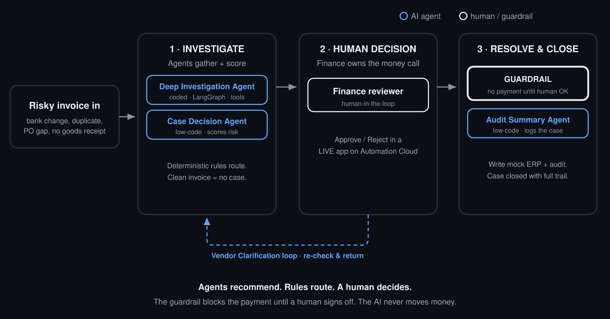

# InvoiceShield Case

**Vendor Payment Exception Case Manager — UiPath AgentHack 2026, Track 1 (Maestro Case)**

UiPath's invoice template processes clean invoices. **InvoiceShield governs the
exceptions** that processing cannot safely automate: bank-account mismatches,
suspected duplicates, PO variance, and missing goods receipts. Each risky
invoice becomes a governed Maestro Case that is investigated by agents, decided
by a human, written to a mock ERP under a hard guardrail, and closed with an
audit trail.

> The one idea: **Maestro governs and routes with deterministic rules, agents
> only judge, a human owns every risky money decision, and a re-entry loop makes
> it a real Case (Track 1), not a disguised workflow.**

## Architecture at a glance



```
            invoice ──▶ Manual trigger
                            │
        ┌───────────────────▼───────────────────────────────┐
        │ STAGE 1 · INVESTIGATE                              │
        │  Evidence tools (deterministic: vendor/PO/GR/dup)  │
        │  Deep Investigation Agent  (coded · LangGraph)     │
        │  Case Decision Agent       (low-code · scores)     │
        └───────────────────┬───────────────────────────────┘
                            ▼
                 Deterministic router (Maestro rules)   ── clean ▶ no case
                            │
        ┌───────────────────▼──────────┐      escalate /
        │ STAGE 2 · HUMAN DECISION      │──── request vendor ───▶ ┌──────────────────────┐
        │  Finance Escalation (human)   │                         │ Vendor Clarification │
        └───────────────────┬──────────┘ ◀─── RE-ENTRY ────────── │ secondary · loop     │
                            ▼            (return to origin,        └──────────────────────┘
        ┌───────────────────▼──────────┐  re-evaluate)
        │ STAGE 3 · RESOLVE & CLOSE     │
        │  Update Mock ERP (human-gated)│   ◀── guardrail: no write without a human
        │  Audit Summary Agent          │
        └───────────────────┬──────────┘
                            ▼
                 Case closed + full audit trail

   Governance wraps all of it: AI Trust Layer (prompt-injection + PII mask),
   tool guardrail, agent traces, and a 30-case eval harness.
```

Full, cited design: [`InvoiceShield_Optimal_Architecture.md`](InvoiceShield_Optimal_Architecture.md)
and [`invoiceshield/docs/architecture.md`](invoiceshield/docs/architecture.md).

## What's in this repo

```
InvoiceShield_Optimal_Architecture.md   the full cited design (why, not just what)
invoiceshield/
  README.md            project readme for the build kit
  data/                5 mock CSVs (vendors, POs, goods receipts, history, incoming)
  logic/               checks.py — deterministic tools + policy + ERP guardrail (+ tests)
  agents/              case-decision + audit-summary (prompts + schemas),
                       deep-investigation (coded LangGraph agent)
  evals/               30 golden cases + run_evals.py (selfcheck + live LLM-as-judge)
  stress_test.py       5-scenario end-to-end stress runner
  docs/                architecture, security-compliance, demo-script
```

## Run it (no API key needed)

```bash
cd invoiceshield
python3 logic/test_checks.py     # deterministic routing brain  -> 9/9
python3 evals/run_evals.py       # 30 golden cases               -> 30/30
python3 stress_test.py           # 5 end-to-end scenarios        -> 5/5
```

To run the live agents and the live eval (LLM-as-judge), set a key:

```bash
pip install -r invoiceshield/agents/deep-investigation-agent/requirements.txt
export ANTHROPIC_API_KEY=...
export INVOICESHIELD_MODEL=claude-sonnet-4-6
python3 invoiceshield/evals/run_evals.py --mode live
```

## Verified results

- **Unit tests:** 14/14 (the deterministic policy + the signal-fusion model).
- **Eval harness:** 39/39 labeled cases (success, edge, adversarial, composite, calibration).
- **Accuracy scoreboard:** 100% recall, 0% false-positive rate. Hard rules alone
  catch 77%; the weak-signal fusion layer adds **+23% recall, the structured
  fraud no single rule can see**. Risk separation 77.6 (flagged) vs 10.0 (clean).
- **Stress test:** 6/6 scenarios. The ERP guardrail blocked every write until a
  human signed off, a prompt-injection "approve now" memo changed no decision, a
  clean invoice opened no case, and a **structured-fraud invoice that passes every
  hard rule** was still caught by signal fusion. About **$275k of distinct
  exposure caught** ($225k mis-routed payment + $50k duplicate) plus $8k
  overbilling flagged.

## Beyond detection: signal fusion, confidence, calibration

Most exception handlers stop at detection. InvoiceShield adds a **weak-signal
fusion** model (`compute_signals` in `logic/checks.py`) that catches structured
fraud which passes every hard rule: a new vendor's first invoice priced just
under an approval limit is flagged even though the bank matches, there is no
duplicate, no variance, and goods are received. Every decision carries a
**confidence** (High / Medium / Low) and **abstains** to investigation when
confidence is low. The full ladder from detection to governed adaptation, with
the measured scoreboard, is in
[`invoiceshield/docs/maturity-and-depth.md`](invoiceshield/docs/maturity-and-depth.md).

## Agents (honest status)

Three agents by design:

1. **Case Decision Agent** (low-code) — scores risk, writes the human-readable
   summary, recommends. Spec ready for Agent Builder. `agents/case-decision-agent/`.
2. **Audit Summary Agent** (low-code) — closure audit trail. `agents/audit-summary-agent/`.
3. **Deep Investigation Agent** (coded, LangGraph) — reconciles conflicting
   evidence. Real, runnable Python. `agents/deep-investigation-agent/`.

Routing is done by deterministic Maestro rules and `logic/checks.py`, never by an
agent. The coded agent is real code; the two low-code agents are prompt + schema
specs to paste into Agent Builder.

## UiPath platform usage

Maestro Case (orchestration + governance), Agent Builder (low-code agents), a
**coded agent on an external framework (LangGraph)** wrapped as a UiPath coded
agent, a Human Action / Action App, AI Trust Layer + tool-level guardrails, agent
traces, and an eval harness. Built in part with a coding agent (Claude Code).

## Verify everything (one command)

```bash
cd invoiceshield && bash run_all.sh
```

Runs the unit tests, the 30-case eval harness, the robustness/fuzz suite, the
consistency check, and the 5-scenario end-to-end stress test. All green. This is
the running, exception-handling prototype.

## Demo console (UI)

```bash
cd invoiceshield && python3 demo_ui.py   # then open http://localhost:8000
```

A dependency-free local UI for demoing the workflow on screen instead of a
terminal. Pick a sample invoice (or type one), watch the deterministic evidence
and the agent's risk verdict, then try the mock-ERP write before and after a
human signs off: the guardrail blocks it until a human owns the decision. It
imports the same `logic/checks.py` engine the eval harness tests, so the screen
and the tests never disagree.

**Batch intake.** Drop multiple invoice files at once (samples in
`data/sample_invoices/`). They are extracted (a regex stand-in for UiPath
Document Understanding) and fanned out: each file becomes its own case, the
risky ones route to a human, the clean ones auto-close, and a summary shows the
split. That is the multi-file upload story, made tangible.

## Status

The Maestro Case plan is built in the AgentHack staging tenant: four stages
(Investigate, Human Decision, Resolve & Close, plus a **Vendor Clarification**
secondary stage with the return-to-origin re-entry loop), a **real Finance
Escalation human action** (a published Action App), and stage rules wired to
case fields.

**The human action runs LIVE on UiPath Automation Cloud.** The Finance
Escalation Action App (SimpleApprovalApp) builds, provisions, and launches at the
Apps runtime URL (`staging.uipath.com/.../apps_/.../run/...`), rendering an
interactive approval form: a Content-for-Review panel, a Comment box, and
Approve / Reject buttons. That is the human-in-the-loop, functioning on
Automation Cloud, not a mockup.

**The solution publishes and deploys to Automation Cloud.** Publishing succeeds:
"Solution package created and deployed, Solution 1 ver. 1.0.0." A **real Case
Decision agent** built in Agent Builder (Autonomous, carrying the full
composite-risk + confidence policy) is deployed and **bound to the Investigate
stage's Case Decision task**, alongside the live Finance Escalation Action App. So
the agent, the human action, and the case package are all on Automation Cloud.

**One known platform limitation.** The "Debug on cloud" path for the Maestro Case
fails at packaging with `No solution tool factory is registered` (reproduced
several times), so a fully-automated end-to-end Case run was not exercised through
that path. Publishing/deploying the solution works. Tracking thread:
<https://forum.uipath.com/t/studio-web-solution-that-contains-maestro-flow-has-a-deploy-bug/5754068>

So the **agentic decision logic runs end to end in this repo** (one command,
above) and is **measured by a 39-case accuracy scoreboard**, the **Case Decision
agent and the human action are deployed and live on Automation Cloud**, and the
Maestro Case is modeled in Studio. See `invoiceshield/docs/architecture.md` for
the full design.

## License

MIT, see [`LICENSE`](LICENSE). External frameworks (LangChain / LangGraph) keep
their own licenses.
